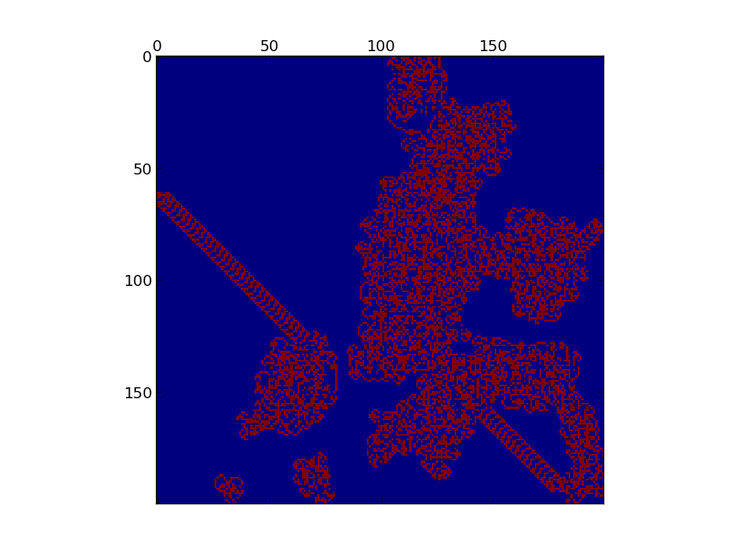
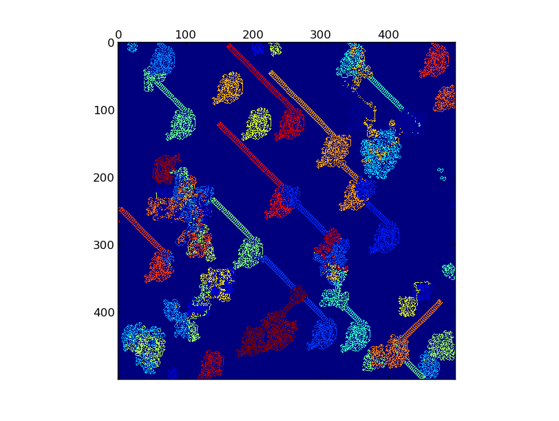
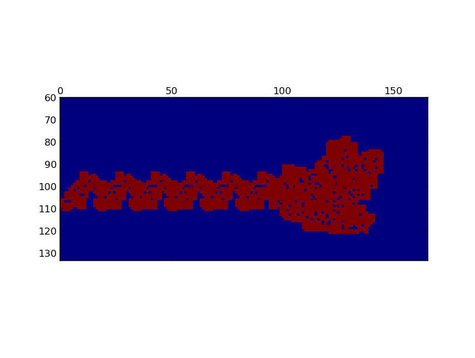
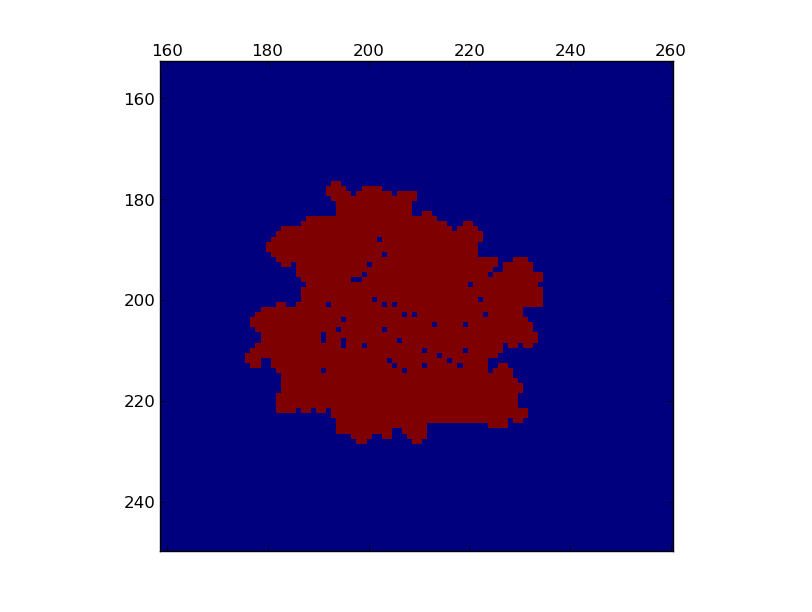
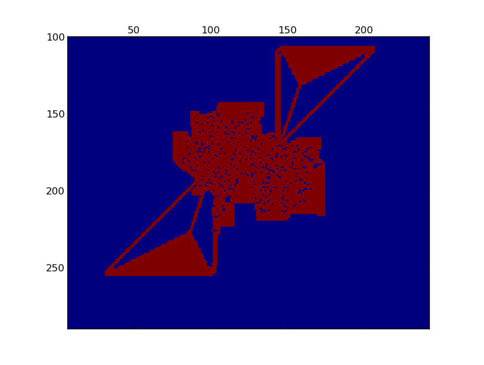

[Langton's ant][1] を python + matplotlib で．

#### Useage
``` 
$ ./langtons_ant.py width height number-of-ants
```
number-of-ants はデフォルトで1.

``` 
$ ./langtons_extended.py width height number-of-ants every_n_step rule
```
where
  
* width, height (required)  : 世界の縦横幅．はみ出たアリは消滅します．
* number-of-ants (optional) : defaults to 1. アリの頭数
* every_n_step (optional)   : defaults to 10. 何 step ごとに描画するか
* rule (optional)           : defaults to LR. state n の時に右に曲がるか左に曲がるかを string として．
なお L,R,l,r のいずれでもない文字は「そのまま直進」と解されます．


##### TODO 
* いろんなルール
* 動画でみられるように
とか

##### screenshots
langtons_ant.py

 


langtons_extended.py
LLRRRLRLRLLR

RLRSRSLSSSLSRSSLSRSLSSS

RRLLLRLLLRRR


[1]: http://en.wikipedia.org/wiki/Langton%27s_ant
